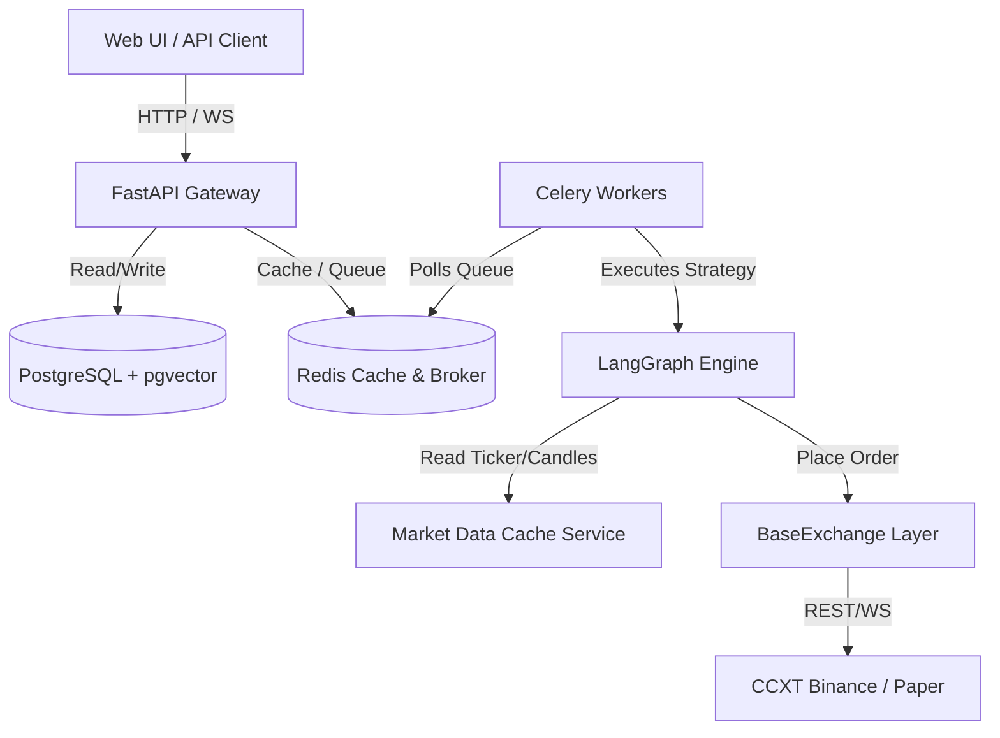
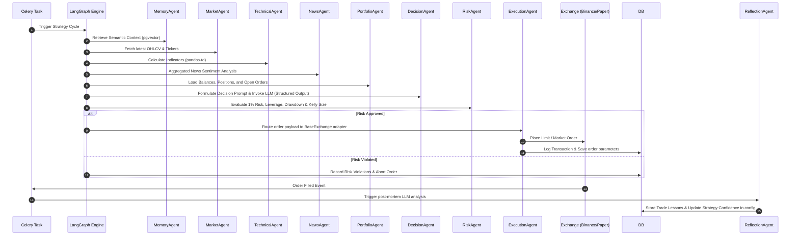

# Architecture Review: Multi-Agent Quantitative Trading Platform

This document presents a comprehensive, production-grade review of the repository's architectural design, code quality, design patterns, and system bottlenecks.

---

## 1. Overall Architecture

The platform is designed as an asynchronous, event-driven trading system built on a modular architecture:

### Key Architectural Layers
1. **API Gateway (FastAPI)**: Serves endpoints for user authentication, strategy management, live status, and WebSocket subscription gateways.
2. **Asynchronous Processing Task Layer (Celery & Redis)**: Triggers periodic strategy executions, handles high-frequency websocket ticker streaming, and processes email alert conditions asynchronously.
3. **Multi-Agent State Machine (LangGraph)**: Models the sequence of trading steps as a directed acyclic graph (DAG) maintaining shared graph state.
4. **Data Persistence Layer (PostgreSQL, pgvector, and Redis)**: Utilizes Redis as a read-through ticker and order book cache, PostgreSQL for permanent relational trading logs, and pgvector for semantic long-term memory embeddings.
5. **Exchange Abstraction Layer (ccxt)**: Wraps paper trading simulations and live exchanges (such as Binance) under a unified BaseExchange interface.

---

## 2. Data Flow

---

## 3. LangGraph Workflow Nodes

The state machine is built with 9 distinct agent nodes executing in order:

| Step | Agent Node | Primary Function | Inputs (from State) | Outputs (to State) |
|---|---|---|---|---|
| 1 | **MemoryAgent** | Semantic search of past reflections | `strategy_id`, `symbols` | `memory_context` |
| 2 | **MarketAgent** | Fetches live market statistics | `symbols`, `exchange` | `tickers`, `ohlcv`, `order_book` |
| 3 | **TechnicalAgent** | Computes technical indicator structures | `ohlcv`, `symbols` | `indicators` |
| 4 | **NewsAgent** | Ingests headlines & calculates scores | `symbols` | `sentiment`, `news_items` |
| 5 | **PortfolioAgent** | Reconciles metrics, balances & orders | `portfolio_id` | `available_balance`, `open_positions`, `portfolio_metrics` |
| 6 | **DecisionAgent** | Formulates trading signals (BUY/SELL/WAIT) | `tickers`, `indicators`, `news_items`, `portfolio_metrics` | `signal`, `confidence`, `reasoning`, `suggested_entry`, `suggested_stop_loss`, `suggested_take_profit` |
| 7 | **RiskAgent** | Checks safety bounds & sizes positions | `signal`, `suggested_entry`, `suggested_stop_loss`, `portfolio_metrics` | `risk_approved`, `risk_violations`, `risk_score`, `suggested_size` |
| 8 | **ExecutionAgent** | Places market/limit orders via exchange | `risk_approved`, `suggested_size`, `signal`, `portfolio_id` | `order_placed`, `order_id`, `execution_error` |
| 9 | **ReflectionAgent** | Evaluates filled order performance | `order_id`, `realized_pnl` | `lessons_learned`, `reflection`, `confidence_adjustment` |

---

## 4. Design Patterns

The codebase employs several industry-standard software design patterns:
1. **Adapter Pattern (BaseExchange)**: `CCXTExchangeBase` adapts CCXT's interface, and `PaperExchange` adapts the `PaperTradingEngine` database operations to comply with the unified `BaseExchange` structure.
2. **Repository Pattern (BaseRepository)**: Decouples relational data query layers from business logic models. Subclasses (e.g., `OrderRepository`, `PortfolioRepository`) isolate SQLAlchemy session queries.
3. **Dependency Injection**: Injects dependencies (`session`, `redis`, `llm`, `exchange`) via the `AgentDependencies` dataclass container.
4. **Strategy Pattern**: The trading strategy logic is isolated inside dynamic LangGraph agent states, allowing the exchange routing logic to remain strategy-agnostic.
5. **State Pattern**: Managed by LangGraph's state machine, enforcing transitions between Market, TA, Decision, Risk, and Execution states.

---

## 5. SOLID Design Principles Assessment

### SOLID Violations
*   **Single Responsibility Principle (SRP) Violations**:
    *   *Violation*: `PaperExchange` acts as both a CCXT market feed fetcher and a relational database transaction engine.
    *   *Fix*: Separate database orders simulation logic from market feed retrieval by creating a `PaperMarketDataDelegator`.
*   **Open/Closed Principle (OCP) Violations**:
    *   *Violation*: Adding new risk rules or technical indicators requires modifications to the core list arrays (`RISK_RULES` in `rules.py` and indicator calculators in `indicators.py`).
    *   *Fix*: Implement a registry plugin mechanism (decorator-based registration) where rules and calculations can be declared externally.
*   **Liskov Substitution Principle (LSP) Violations**:
    *   *Violation*: `PaperExchange.watch_balance()` throws `NotImplementedError` because simulated accounts do not support WebSocket balance subscriptions.
    *   *Fix*: Split `BaseExchange` interface into `BaseExchangeREST` and `BaseExchangeWebSocket` segregation structures.
*   **Interface Segregation Principle (ISP) Violations**:
    *   *Violation*: `BaseExchange` enforces implementation of perpetual futures funding rate watch/fetch methods (`watch_funding_rate`, `fetch_funding_rate`) even for exchanges that only support spot trading.
    *   *Fix*: Segregate perpetual-specific methods into a separate interface.

---

## 6. Code Quality Analysis

### Circular Dependencies
- **Resolution**: Circular dependencies between models, repositories, and nodes are avoided using functional/in-method imports (e.g., `import uuid` or `from app.infrastructure.repositories.portfolio_repository import PortfolioRepository` imported inside methods). While this prevents runtime failures, it makes static analysis difficult. Moving type declarations to `if TYPE_CHECKING:` scopes where possible helps clean up imports.

### Duplicate Code
- **Prompt String Manipulation**: The formatting of positions, tickers, and news items has minor duplication between `decision_node.py` and `trade_reflection_node.py`.
- **Database Rollback Blocks**: Session recovery rollbacks are written independently across various celery worker tasks and agent nodes.

### Dead Code
- **Legacy NotImplementedError Stubs**: A few original stubs or placeholder exception clauses remain in commented blocks throughout older repository models.

---

## 7. Operational & System Constraints

### Performance Bottlenecks
1. **Synchronous Embedding Creation**: Celery workers generate embeddings sequentially. For strategies evaluating multiple symbols, this can block execution threads.
2. **SQLite Database Locking**: SQLite database transactions can block if live websocket tickers perform high-frequency writes.
3. **REST Polling Fallback**: In the absence of CCXT Pro WebSocket support, the system falls back to REST polling. This can increase latency and risk hitting rate limits on exchanges.

### Security Vulnerabilities
1. **Plaintext Secrets**: API keys, DB passwords, and exchange credentials in `.env` are stored in plaintext. Secrets rotation and vaults (e.g., AWS Secrets Manager or HashiCorp Vault) should be integrated for production.
2. **Prompt Injection**: Unfiltered input payloads from external feeds (such as news titles) could potentially alter the Decision Agent's output instructions. Hard limits enforced by the `RiskAgent` act as a crucial safeguard here.

### Scalability Concerns
1. **Celery Worker Thread Allocation**: Executions are single-threaded by default. As the number of registered active strategies grows, the task queue may experience delays.
2. **WebSocket Connection Limits**: Subscribing to multiple ticker connections via a single exchange gateway can hit connection limits on exchanges. An external market data broker service (e.g., Redis Streams) is recommended.

---

## 8. Suggested Improvements

1. **Registry-Based Risk Engine**: Refactor `RISK_RULES` to use decorator-based registration (`@risk_rule`), making it easier to add or remove rules dynamically.
2. **Market Data Broker Service**: Separate live WebSocket ingestion into an independent service that streams to Redis Streams, allowing workers to read cached data without opening multiple exchange connections.
3. **Vault Integration**: Secure API keys and exchange secrets using a secret manager.
4. **Interface Segregation**: Split `BaseExchange` to isolate Spot vs. Futures features, avoiding unsupported WebSocket methods.
