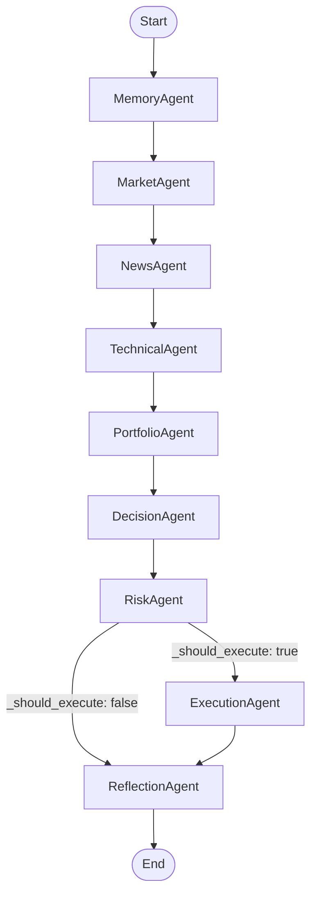
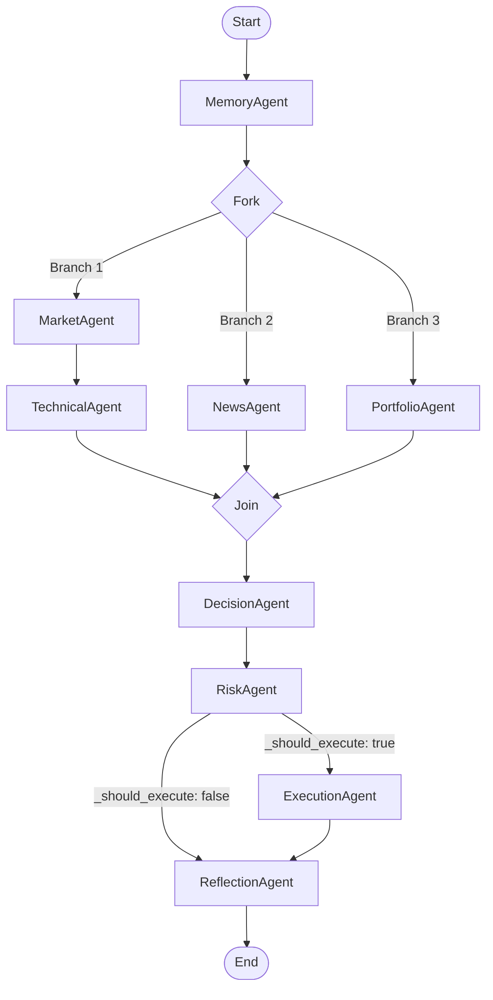

# LangGraph Workflow Review

This document provides an engineering review of the multi-agent LangGraph workflow inside the platform, identifying latency bottlenecks, reliability concerns, state persistence gaps, and recommending an optimized DAG structure.

---

## 1. Current Workflow Analysis

The current compiled graph in [builder.py](file:///c:/Users/Lalith%20Sai%20Kumar/Desktop/mirofish/crypto-trading-platform/backend/app/agents/graph/builder.py) has the following sequential topology:



### Major Bottlenecks & Gaps

1.  **Sequential Execution Latency (Critical Path)**
    *   *Issue*: Nodes `market` (fetching tickers/candles), `news` (fetching headlines), and `portfolio` (fetching balances/positions) are executed in a strict sequence.
    *   *Impact*: The total latency is the sum of all API calls. In fast-moving crypto markets, executing independent REST and database queries sequentially blocks execution threads.
2.  **No State Checkpoints or Persistence**
    *   *Issue*: The graph is compiled via `graph.compile()` without registering a `checkpointer` (e.g., `SqliteSaver` or `MemorySaver`).
    *   *Impact*: There is no transaction history or state tracking. If the process crashes midway (e.g., during the execution agent call), the state is lost, preventing transaction recovery or post-mortem debugging.
3.  **Missing Node Retry Policies**
    *   *Issue*: API calls to LLMs (Decision, Reflection) and exchange endpoints (Market, Execution) do not have retry policies configured on the graph nodes.
    *   *Impact*: Transient network drops, rate limits, or exchange timeouts cause the graph run to fail or degrade to stubs immediately.
4.  **No Human-in-the-Loop Breakpoints for High-Risk Orders**
    *   *Issue*: High-value trades are placed immediately by the Execution agent without manual intervention checkpoints.
    *   *Impact*: While suitable for fully autonomous trading, staging environments or high-volume portfolios benefit from breakpoints before order execution.
5.  **State Merge Race Conditions in Parallel Paths**
    *   *Issue*: If nodes are parallelized, fields like `node_errors: dict[str, str]` do not have merge reducers defined in `TradingState`.
    *   *Impact*: Parallel agents writing to the same state keys would overwrite each other instead of merging their errors.

---

## 2. Recommended Optimized Workflow

We can optimize the critical path by parallelizing independent tasks using LangGraph's fan-out/fan-in branching. 



### Advantages of the Optimized Workflow
*   **Reduced Latency**: `MarketAgent` (and downstream `TechnicalAgent`), `NewsAgent`, and `PortfolioAgent` execute concurrently. The critical path latency is reduced to `Max(Market + Technical, News, Portfolio)` instead of `Sum(Market, News, Portfolio, Technical)`.
*   **Logical Dependencies**: `TechnicalAgent` executes immediately after `MarketAgent` (which populates the required `ohlcv` state data) without waiting for news or portfolio queries.

---

## 3. Detailed Review Findings

### Unnecessary Nodes
*   None. Every node has a distinct responsibility mapping to the modular agent architecture.

### Missing Retries
*   **LLM calls** in `DecisionAgent` and `ReflectionAgent` should configure a LangGraph `RetryPolicy` to handle transient rate limits (HTTP 429) or timeouts:
    ```python
    from langgraph.prebuilt import RetryPolicy
    
    # Example node registration with retry policy
    graph.add_node(
        "decision", 
        decision_agent.run, 
        retry=RetryPolicy(max_attempts=3, backoff_factor=2.0)
    )
    ```

### Missing Checkpoints & Persistence
*   To enable transaction recovery, audit logs, and state replay, compile the graph with a persistent memory checkpointer:
    ```python
    from langgraph.checkpoint.memory import MemorySaver
    
    memory = MemorySaver()
    compiled_graph = graph.compile(checkpointer=memory)
    ```

### Potential Race Conditions
*   If concurrent paths are added, the `node_errors` dictionary in `TradingState` requires a custom reducer function to merge dictionaries instead of overwriting them:
    ```python
    def merge_dicts(left: dict, right: dict) -> dict:
        return {**left, **right}
        
    class TradingState(BaseModel):
        node_errors: Annotated[dict[str, str], merge_dicts] = Field(default_factory=dict)
    ```

### State Size Growth
*   The `messages` list is annotated with `add_messages`, meaning it accumulates all messages over time. For long-running graphs, this list grows indefinitely, causing memory footprint expansion.
*   *Solution*: Implement message trimming or truncation rules at the end of each cycle in the `reflection` node.
